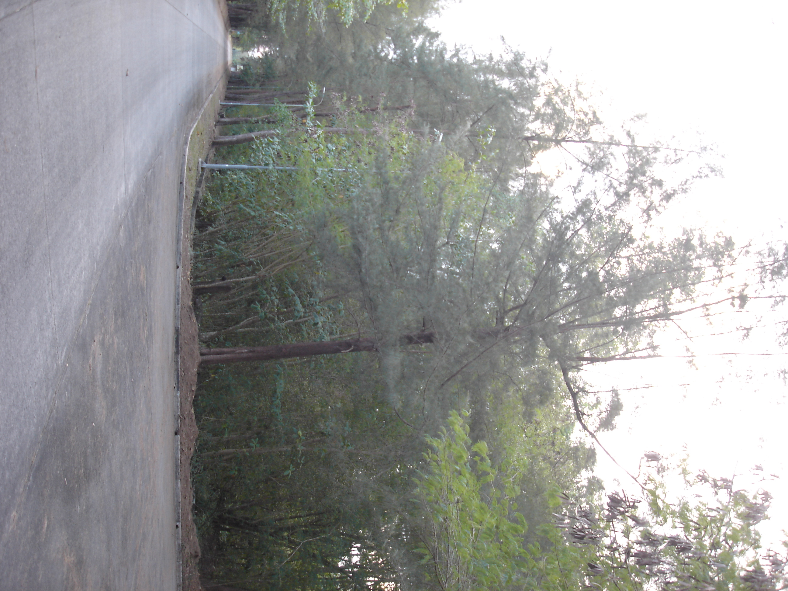
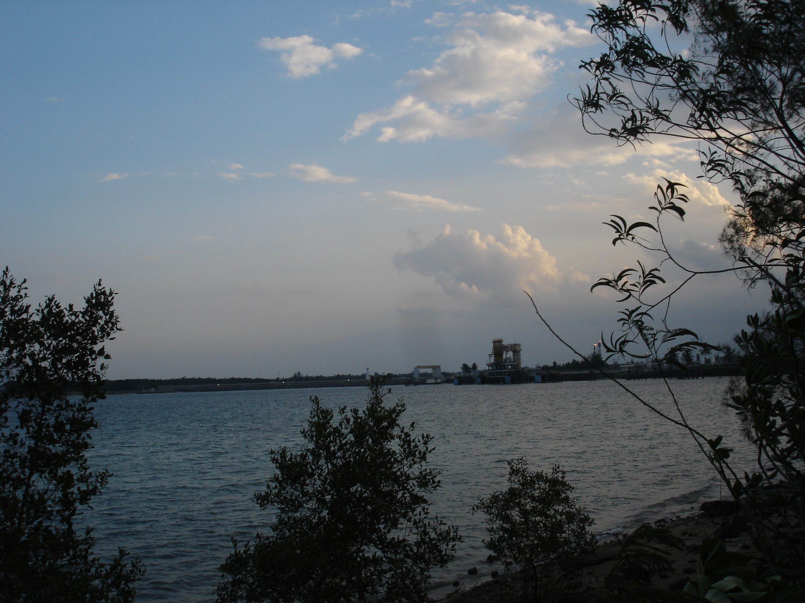
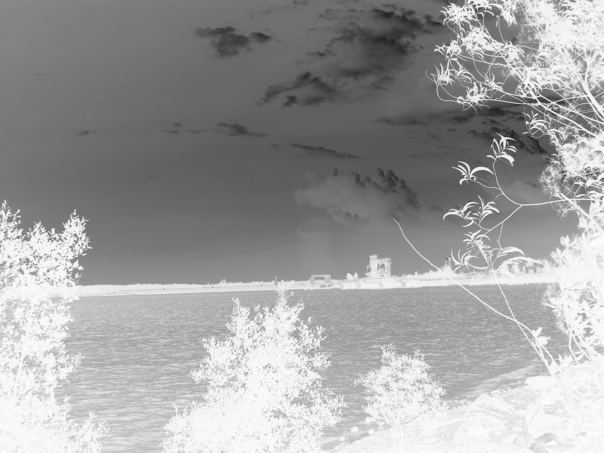
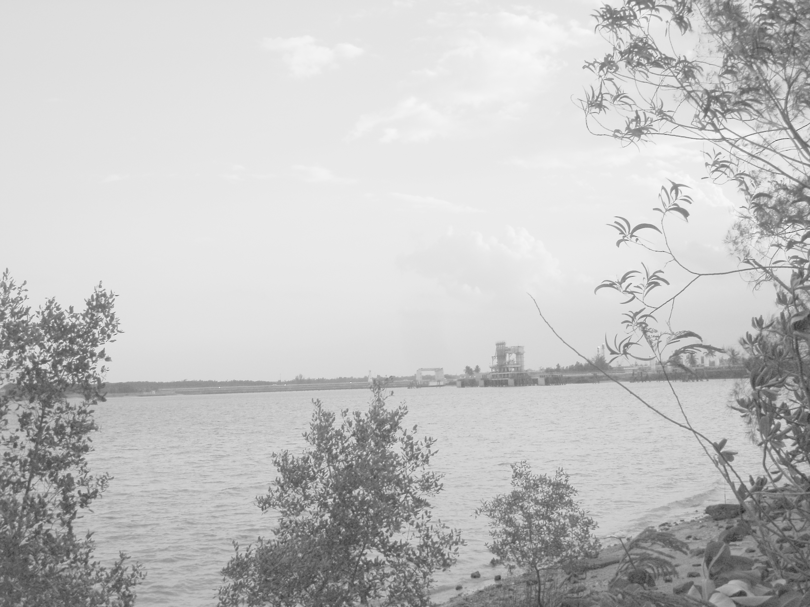
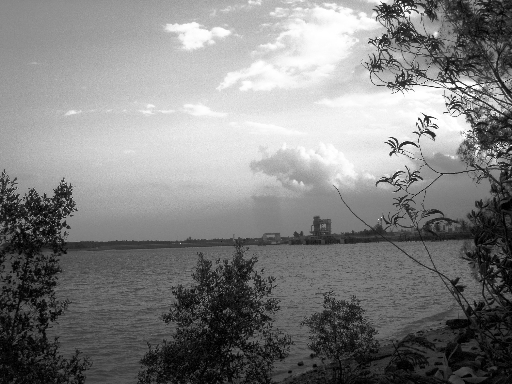
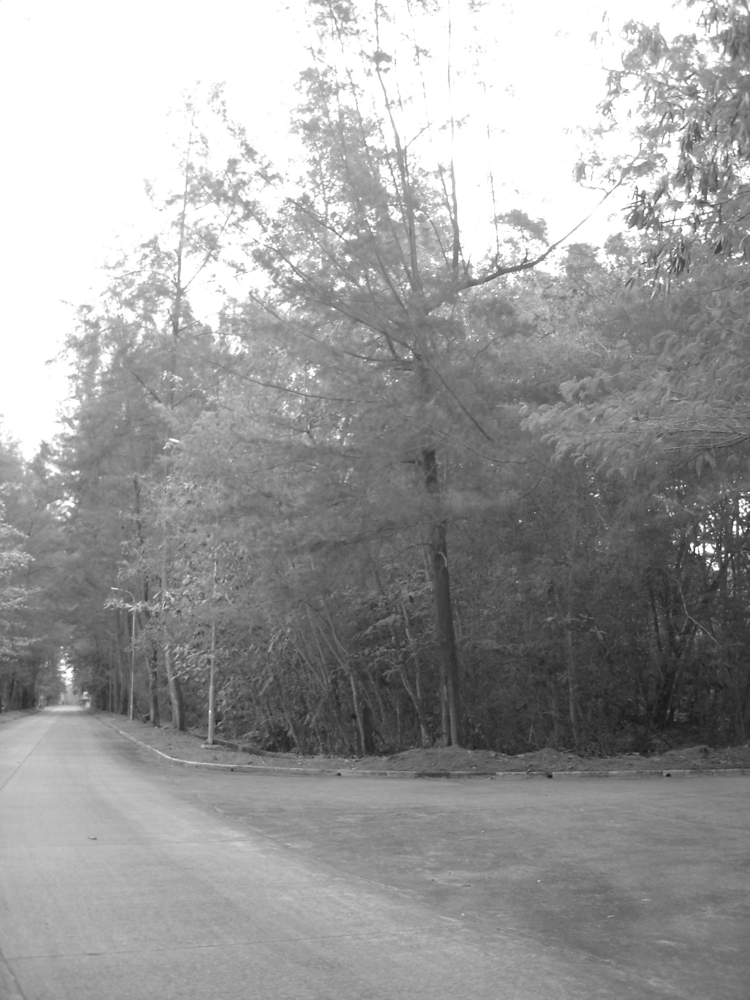
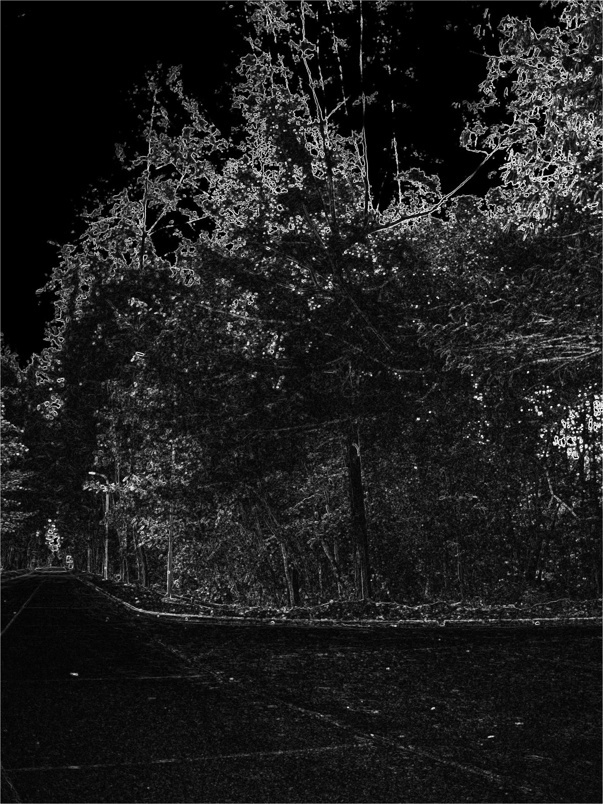
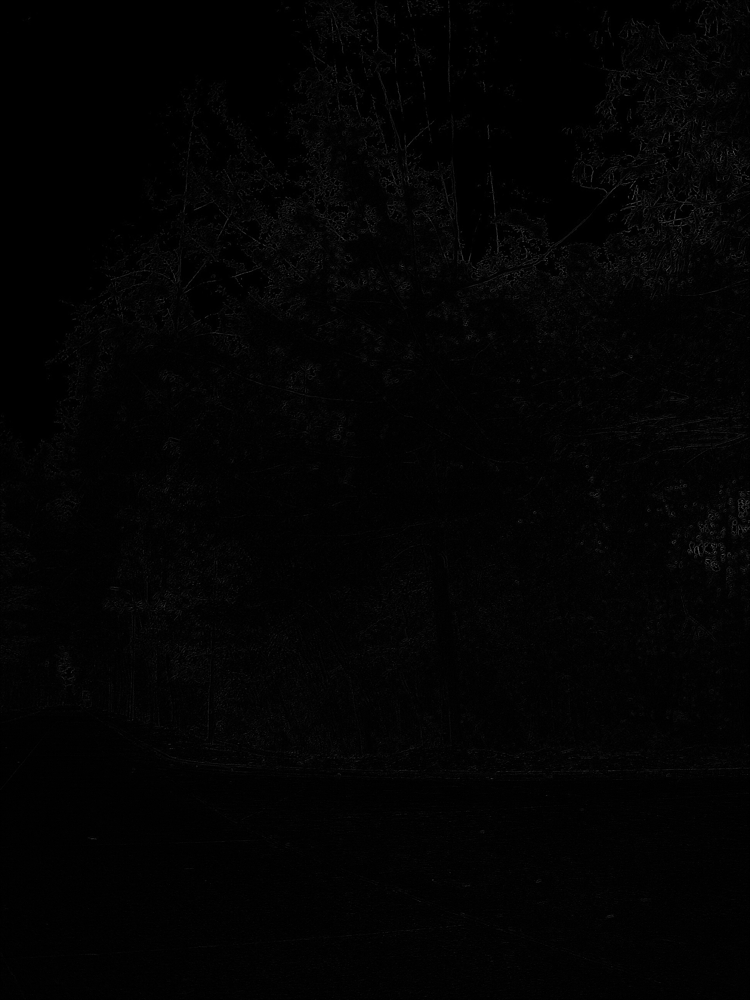

# PCV-Tasks — Pengolahan Citra Digital

Kumpulan program Python untuk tugas **Pengolahan Citra Digital**, dari operasi dasar (baca/statistik citra) sampai transformasi intensitas, ekualisasi histogram, dan filter spasial — semuanya dihitung manual memakai **NumPy**, tanpa mengandalkan fungsi jadi dari OpenCV untuk proses intinya.

---

## 📋 Daftar Isi

* [Ringkasan Tugas](#-ringkasan-tugas)
* [Teknologi yang Digunakan](#-teknologi-yang-digunakan)
* [Struktur Folder](#-struktur-folder)
* [Instalasi](#-instalasi)
* [Persiapan File Gambar](#-persiapan-file-gambar)
* [Tugas 1 — Statistik & Patch Citra](#-tugas-1--statistik--patch-citra)
* [Tugas 2 — Transformasi Intensitas & Ekualisasi Histogram](#-tugas-2--transformasi-intensitas--ekualisasi-histogram)
* [Tugas 3 — Filter Spasial](#-tugas-3--filter-spasial)
* [Catatan](#-catatan)
* [Lisensi](#-lisensi)

---

## 📖 Ringkasan Tugas

| Tugas | File | Fokus |
|---|---|---|
| 1 | `tugas 1 pcv.py` | Baca citra, statistik piksel, patch 8×8, rasio kompresi, konversi warna |
| 2 | `tugas 2 pcv.py` | Transformasi intensitas (negatif, log, power-law, contrast stretching) & ekualisasi histogram manual |
| 3 | `tugas 3 pcv.py` | Konvolusi 2D manual: smoothing, sharpening, edge detection, median filter |

Aturan yang dipegang di Tugas 2 & 3: **dilarang** memakai fungsi bawaan OpenCV/NumPy untuk proses citranya (`cv2.equalizeHist`, `cv2.LUT`, `cv2.filter2D`, `cv2.GaussianBlur`, `cv2.Sobel`, `np.histogram`, dsb). Semua histogram, LUT, dan konvolusi dihitung sendiri lewat operasi array NumPy. `cv2.imread`/`cv2.imwrite`/`matplotlib` hanya dipakai untuk baca & tampilkan, bukan untuk memproses.

---

## 🛠 Teknologi yang Digunakan

* **Python 3**
* **NumPy** — array & operasi matematika citra
* **OpenCV** — baca/tulis file gambar saja
* **Matplotlib** — visualisasi citra & histogram

---

## 📁 Struktur Folder

```text
pcv-tasks/
│
├── tugas 1 pcv.py          # Tugas 1
├── tugas 2 pcv.py             # Tugas 2
├── tugas 3 pcv.py    # Tugas 3
├── README.md
│
├── gambar_terang.JPG
├── gambar_gelap.JPG
└── gambar_kontras_rendah.JPG
```

File hasil (`hasil_*.png`) akan dibuat otomatis oleh Tugas 2 dan Tugas 3 di folder yang sama saat script dijalankan.

---

## 💻 Instalasi

```bash
pip install numpy opencv-python matplotlib
```

Cek instalasi:

```bash
pip list
```

Pastikan `numpy`, `opencv-python`, dan `matplotlib` muncul di daftar.

---

## 🖼 Persiapan File Gambar

Siapkan tiga gambar dengan nama berikut, taruh di folder yang sama dengan script:

| File | Fungsi |
|---|---|
| `gambar_terang.JPG` | Citra dengan kondisi terang |
| `gambar_gelap.JPG` | Citra dengan kondisi gelap |
| `gambar_kontras_rendah.JPG` | Citra dengan kontras rendah |

Kalau nama file gambar kamu berbeda, ubah variabel `PATH_TERANG`/`PATH_GAMBAR` di bagian atas tiap script sesuai nama file kamu.

---

## 🔹 Tugas 1 — Statistik & Patch Citra

Jalankan:

```bash
python "tugas 1 pcv.py"
```

Mencakup:

1. **Uji lingkungan** — baca & tampilkan satu foto, konversi BGR→RGB untuk ditampilkan lewat Matplotlib.
2. **Statistik citra** — `shape`, `dtype`, min, max, mean dari tiga citra (terang, gelap, kontras rendah).
3. **Patch 8×8** — mengambil potongan 8×8 piksel dari titik paling gelap dan paling terang (dicari lewat citra grayscale).
4. **Rasio kompresi** — membandingkan ukuran data mentah (`tinggi × lebar × channel × byte`) dengan ukuran file di disk.
5. **Bonus**: menu konversi warna (grayscale, red/blue/green/yellow-scale), hasil disimpan sebagai `.png` — contoh: `gambar_terang_grayscale.png`.

| Asli | Grayscale |
|---|---|
|  |  |

<details>
<summary>Contoh output terminal</summary>

```text
Citra   : gambar_terang.JPG
  shape : (720, 1280, 3)
  dtype : uint8
  min   : 0
  max   : 255
  mean  : 142.37

Ukuran data mentah     : 2,764,800 byte
Ukuran file di disk    : 345,600 byte
Rasio kompresi         : 8.00 : 1
```

</details>

---

## 🔹 Tugas 2 — Transformasi Intensitas & Ekualisasi Histogram

Jalankan:

```bash
python "tugas 2 pcv.py"
```

Semua histogram, PDF, CDF, dan LUT dihitung manual (loop per level intensitas 0–255), tanpa `np.histogram`/`np.bincount`/`cv2.equalizeHist`/`cv2.LUT`.

**Fungsi utama:**

| Fungsi | Kegunaan |
|---|---|
| `baca_grayscale_manual()` | Konversi ke grayscale manual: `0.299R + 0.587G + 0.114B` |
| `transformasi_negatif()` | `s = (L-1) - r`, membalik gelap↔terang |
| `transformasi_log()` | `s = c·log(1+r)`, memperjelas detail area gelap |
| `transformasi_power_law()` | Gamma correction: `s = c·r^γ` (γ<1 lebih terang, γ>1 lebih gelap) |
| `peregangan_kontras()` | Contrast stretching piecewise-linear 2 titik kontrol |
| `hitung_histogram_manual()` | Hitung kemunculan tiap level intensitas |
| `hitung_pdf()` / `hitung_cdf_manual()` | Probability & cumulative distribution function |
| `ekualisasi_histogram_manual()` | Histogram → PDF → CDF → LUT → terapkan ke citra |

**Hasil yang disimpan:** `hasil_negatif.png`, `hasil_log.png`, `hasil_ekualisasi.png`

### Contoh hasil

| Asli | Negatif | Log |
|---|---|---|
|  |  |  |

| Sebelum Ekualisasi | Sesudah Ekualisasi |
|---|---|
|  |  |

> Gambar di atas otomatis muncul setelah kamu menjalankan `tugas 2 pcv.py` dan file `hasil_*.png` sudah ada di folder yang sama dengan README ini.

---

## 🔹 Tugas 3 — Filter Spasial

Jalankan:

```bash
python "tugas 3 pcv.py"
```

Inti tugas ini adalah **konvolusi 2D manual** (`konvolusi_2d()`): kernel digeser piksel demi piksel di atas citra (dengan zero-padding manual), dikalikan elemen-per-elemen, lalu dijumlahkan — tanpa `cv2.filter2D`.

**Filter yang didemonstrasikan:**

| Kategori | Filter | Fungsi |
|---|---|---|
| Smoothing | Mean filter | `buat_kernel_mean()` |
| Smoothing | Gaussian filter | `buat_kernel_gaussian()` |
| Smoothing (non-linear) | Median filter | `filter_median_manual()` — pakai median tetangga, bukan konvolusi, cocok untuk noise salt & pepper |
| Sharpening | Kernel penajaman 3×3 | `buat_kernel_sharpen()` |
| Edge Detection | Sobel X, Sobel Y, magnitude | `deteksi_tepi_sobel()` |
| Edge Detection | Laplacian | `buat_kernel_laplacian()` |

**Hasil yang disimpan:** `hasil_mean.png`, `hasil_gaussian.png`, `hasil_median.png`, `hasil_sharpen.png`, `hasil_sobel_magnitude.png`, `hasil_laplacian.png`

### Contoh hasil

**Smoothing:**

| Asli | Mean 3×3 | Gaussian 5×5 | Median 3×3 |
|---|---|---|---|
|  |  |  |  |

**Sharpening:**

| Asli | Sharpening |
|---|---|
|  |  |

**Edge Detection:**

| Sobel Magnitude | Laplacian |
|---|---|
|  |  |

---

## ⚠️ Catatan

1. Pastikan nama file gambar di tiap script (`PATH_TERANG`, `PATH_GAMBAR`, dll) sesuai dengan file gambar kamu.
2. OpenCV membaca gambar dalam urutan channel **BGR**, bukan RGB — semua konversi ke grayscale di Tugas 2 & 3 dilakukan manual dengan rumus luminance, bukan `cv2.cvtColor`.
3. Nilai piksel `uint8` berada di rentang **0–255**; semua fungsi transformasi melakukan `clip` ke rentang ini sebelum dikonversi ke `uint8`.
4. Tugas 2 & 3 memproses citra secara **grayscale** (2D), bukan citra berwarna 3 channel.
5. Untuk citra berukuran besar, konvolusi manual (loop piksel per piksel) di Tugas 3 bisa terasa lambat — ini wajar karena tujuannya menunjukkan mekanisme konvolusi, bukan performa.
6. Gambar hasil (`hasil_*.png`) dibuat otomatis di folder yang sama saat script dijalankan; commit/upload file-file ini kalau ingin README menampilkan hasil secara langsung di GitHub.

---

## 📄 Lisensi

Proyek ini dibuat untuk keperluan pembelajaran.
